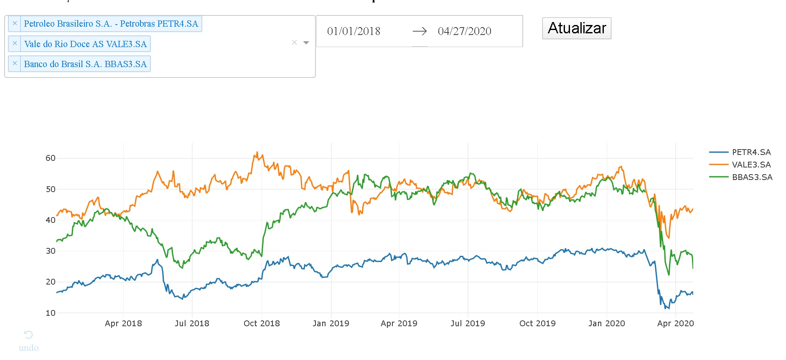

# Bovespa webapp

Simples webapp para consulta e comparação do preço de fechamento 30 ações na Bovespa com um gráfico interativo. O app consulta dados diários até d-1, podendo selecionar diversas ações. 

Construído com [Dash](https://plotly.com/dash/), utiliza dados do Yahoo Finance obtidos através do pacote [yfinance](https://github.com/rodrigobercini/yfinance).

Para conferir o webapp: https://fast-fortress-49697.herokuapp.com/.

